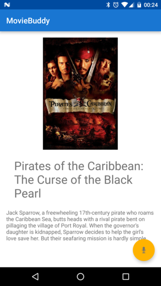
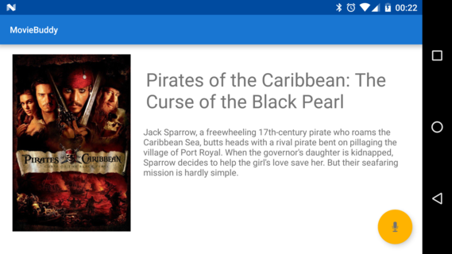
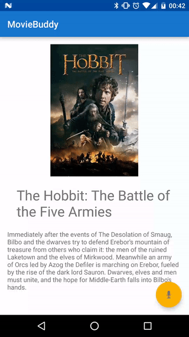
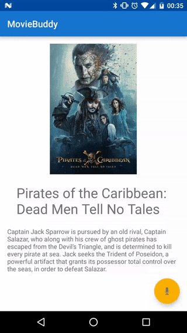

# Movie Buddy
A simple app for movie recommendations. It will fetch popular movies from [The Movie DB](https://www.themoviedb.org/) and recommends a (genre specific) random movie.

## Getting started

A personal movie db API key needs to be applied in [strings.xml](app/src/main/res/values/strings.xml).
The entry should look like this: 
```xml
<string name="the_movie_db_api_key">YOUR_KEY</string>
```

## Layout
The app is optimized for portrait and landscape mode.

 


## How it works
The app will start with an movie recommendation already in place. If u want to get another movie recommendation, u have three ways to achieve that.

### Shake the phone
Shake the phone to get a new recommendation

### Swipe
Swipe on the screen to get the next video.



### Speech recognition
Press the yellow FAB-Button on the right bottom corner and use one of the following commands:
+ "next"
+ "next movie"
+ "next ``<genre>`` movie"



## License

The contents of this repository are covered under the [MIT License](LICENSE)